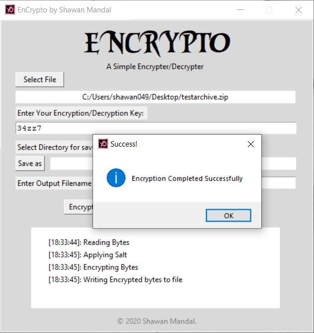

# ENCRYPTO!

Encrypto is a Encryption/Decryption program that Encrypts your files using 256-bit AES Algorithm that uses a passkey (probably a password in your case) to Encrypt your files. Therefore it is impossible to Decrypt the files that are encrypted making it safe to keep your files locked away from others.

## Required Modules

Use the package manager [pip](https://pip.pypa.io/en/stable/) to install these required modules.

```bash
pip install cryptography
```

## Usage

Run the main script file or download the compiled executable from published packages. <br> <br>


## License
[MIT](https://choosealicense.com/licenses/mit/)
